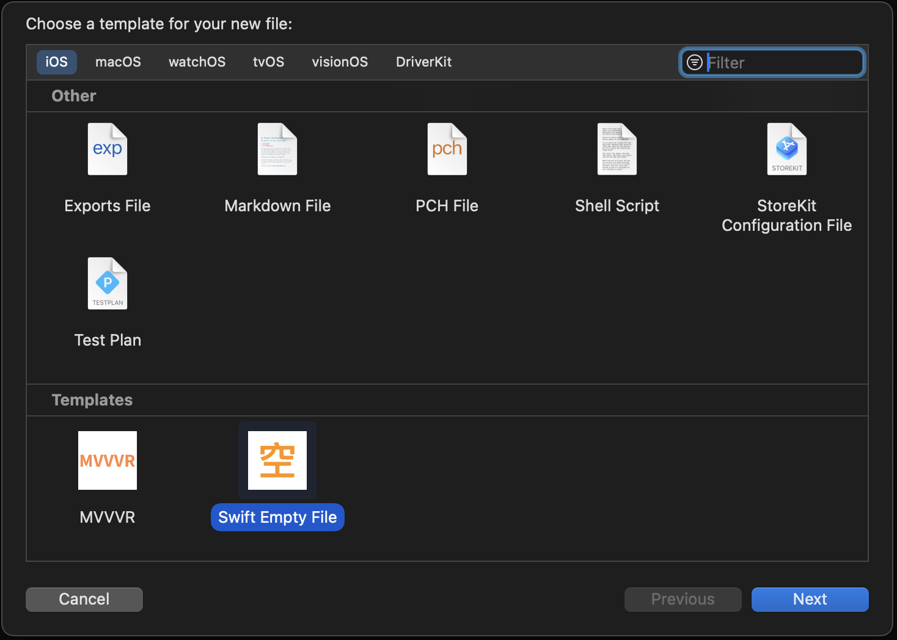

Title: Swift Empty File Template  
分類: [Xcode][L2]  
Discussion: [Link][L3]  

## 前言

創建一個 Xcode Template 用來產出僅 import UIKit 的檔案.

## 使用方法

下載[最新版本][L1] Template.zip, 解壓縮後將 `Swift Empty File.xctemplate` 移動到目錄之下, 如果目錄不存在, 請自行創建.

```
~/Library/Developer/Xcode/Templates
```

創建 New File 時, 捲動到最下面就會看到 Template.



[L1]: https://github.com/shinrenpan/Swift-Empty-Template/releases/latest/
[L2]: https://github.com/shinrenpan/Note/discussions?discussions_q=is%3Aopen+label%3AXcode
[L3]: https://github.com/shinrenpan/Note/discussions/25
